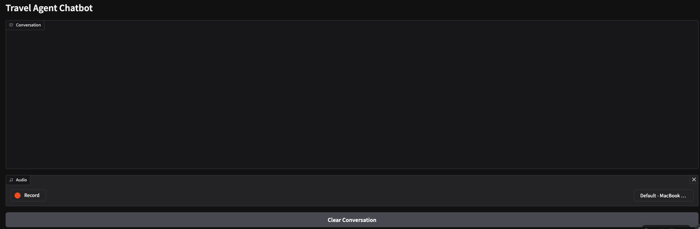

# Travel Agent Conversational Chatbot

A voice-enabled conversational chatbot that acts as a Southern California travel assistant, helping users with their travel inquiries and requests.

## Features

- **Voice Input**: Speak directly to the chatbot using your microphone
- **Natural Language Processing**: Powered by OpenAI's language models
- **Speech Recognition**: Transcribes your voice using Whisper
- **Text-to-Speech**: Responds with a natural-sounding voice using Kokoro
- **Conversation History**: Maintains context throughout your conversation

## Requirements

- Python 3.8+
- CUDA-compatible GPU (recommended for optimal performance)
- Microphone for voice input
- Speakers for audio output

## Installation

1. Clone this repository:
   ```
   git clone https://github.com/yourusername/travel-agent-chatbot.git
   cd travel-agent-chatbot
   ```

2. Install the required dependencies:
   ```
   pip install -r requirements.txt
   ```

3. Create a `.env` file in the project root with your API key:
   ```
   DIGITALOCEAN_GENAI_ACCESS_TOKEN_TRAVEL=your_api_key_here
   ```
4. For Kokoro + ONNX TTS
Download the following files from their GitHub page: [Kokoro](https://github.com/thewh1teagle/kokoro-onnx/blob/main/examples/app.py)

- kokoro-v1.0.onnx
- voices-v1.0.bin

5. Additional Requirements
For MacOS/Linux assuming you have already installed xcode developer tools, this also requires brew installing for the Microphone capabilities:

```
brew install portaudio
pip install pyaudio
```

## Screenshot

## Usage

1. Run the application:
   ```
   python conv_agent.py
   ```

2. A Gradio interface will launch in your default web browser
3. Click the microphone button and speak your travel-related question
4. The chatbot will transcribe your speech, process your request, and respond both in text and with voice

## Clearing Conversation

Click the "Clear Conversation" button to start a new conversation while preserving the chatbot's travel assistant persona.

## License

[Your chosen license]

## Acknowledgments

- This project uses Gradio for the web interface
- Speech recognition powered by OpenAI's Whisper
- Text-to-speech provided by Kokoro
- Language model provided by DigitalOcean 